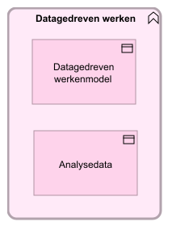

# Toegangsverlening

Vanuit datagedreven werken kijken we naar alle informatie die in de gemeente verwerkt wordt. Niet alleen naar de dienstverleningsinformatie (de [`kernconcepten`](/kernconcepten/index.md)) maar ook naar specifieke informatie uit de diverse vakgebieden. Datagedreven werken is daarom als aparte view gepositioneerd.

Uitwerking van dit onderwerp valt buiten de scope van deze doelarchitectuur (Zie [Gemeentelijk GegevensModel](https://www.gemeentelijkgegevensmodel.nl)).

