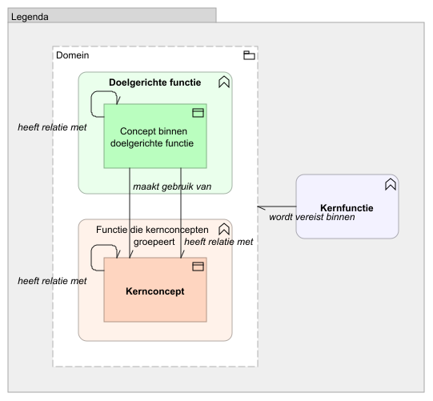
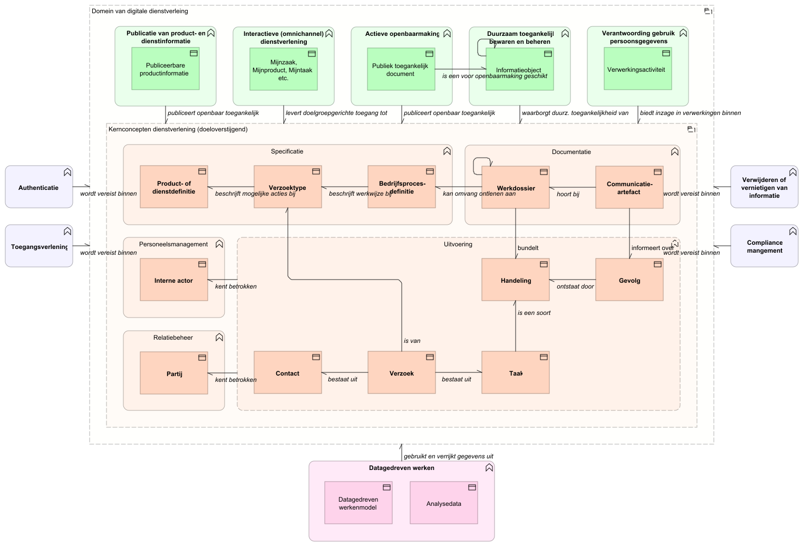

# Overzicht (op hoofdlijnen) van generieke dienstverleningselementen

<svg viewBox="0 0 100 100" width="100%" xmlns="http://www.w3.org/2000/svg">

  <title>Overzicht in Archimate van generieke dienstverleningselementen en relaties daartussen</title>

  <image href="./img/overzicht_op_hoofdlijnen_van_generieke_dienstverleningselementen.svg"
         x="0" y="0" width="100" height="100" preserveAspectRatio="xMidYMid meet" />

  <a href="#left-upper" target="./kernconcepten/index.md">
    <rect x="0" y="0" width="83" height="74"
          fill="white" fill-opacity="0" pointer-events="all"
          style="cursor:pointer" />
  </a>

  <a href="#left-lower" target="./doelgerichte-functies/index.md">
    <rect x="0" y="74" width="17" height="26"
          fill="white" fill-opacity="0" pointer-events="all"
          style="cursor:pointer" />
  </a>

  <a href="#right-upper" target="./kernfuncties/index.md">
    <rect x="17" y="0" width="83" height="63"
          fill="white" fill-opacity="0" pointer-events="all"
          style="cursor:pointer" />
  </a>

  <a href="#right-lower" target="./datagedreven-werken/index.md">
    <rect x="83" y="63" width="17" height="37"
          fill="white" fill-opacity="0" pointer-events="all"
          style="cursor:pointer" />
  </a>
</svg>

Zoals in [de introductie](./over_deze_architectuur.md#introductie-in-beelden) toegelicht onderkennen we drie soorten `Generieke Dienstverleningselementen`.

Links boven staan de [`Kernconcepten`](./kernconcepten/index.md). Ze zijn een abstractie van wat zich aan de binnenkant van de gemeentelijke applicaties afspeelt. Deze abstractie beperkt zich tot de informatie die nodig is om de [`Doelgerichte functies`](./doelgerichte-functies/index.md) te kunnen bedienen. In veel gevallen is dat het inzien van informatie, maar in sommige gevallen betreft het ook beperkte interactie met de applicaties. Bijvoorbeeld als een partij iets aanleveren via het MijnServices portaal.

Rechts boven zien we de [`Kernfuncties`](./kernfuncties/index/.md): generieke functionaliteit die in de meeste applicaties voorkomt. Rechts onder is voor de volledigheid het datagedreven werken getoond. Een onderwerp dat verder buiten de scope van deze doelarchitectuur valt (Zie [Gemeentelijk GegevensModel](https://www.gemeentelijkgegevensmodel.nl/)).

// TODO: Indeling veranderen comform introductie? -> Doelgerichte functies boven, kernconcepten in het midden, datagedrevenwerken onder? En dan functies links en rechts?

// TODO: Menu hieronder weg? Moet nu zowel op pagina's als hier onderhouden worden.

## Detailviews voor doelgerichte functies

- [Actieve openbaarmaking](./doelgerichte-functies/actieve-openbaarmaking.md)
- [Duurzaam toegankelijk bewaren en beheren](./doelgerichte-functies/duurzaam-toegankelijk-bewaren-en-beheren.md)
- [Interactieve (omnichannel) dienstverlening](./doelgerichte-functies/interactieve-omnichannel-dienstverlening.md)
- [Publicatie van product- en dienstinformatie](./doelgerichte-functies/publicatie-van-product-en-dienstinformatie.md)
- [Verantwoording gebruik persoonsgegevens](./doelgerichte-functies/verantwoording-gebruik-persoonsgegevens.md)

## Detailviews voor kernfuncties

- [Authenticatie](./kernfuncties/authenticatie.md)
- [Compliance management](./kernfuncties/compliance-management.md)
- [Toegangsverlening](./kernfuncties/toegangsverlening.md)
- [Vernietigen en verwijderen](./kernfuncties/vernietigen-en-verwijderen.md)

## Detailviews voor kernconcepten

### Specificatie

- [Bedrijfsprocesdefinitie](./kernconcepten/specificatie/bedrijfsprocesdefinitie.md)
- [Product- of dienstdefinitie](./kernconcepten/specificatie/product-of-dienstdefinitie.md)
- [Verzoektype](./kernconcepten/specificatie/verzoektype.md)

### Personeelsmanagement en relatiebeheer

- [Interne actor](./kernconcepten/personeelsmanagement/interne-actor.md)
- [Partij](./kernconcepten/relatiebeheer/partij.md)

### Uitvoering

- [Contact](./kernconcepten/uitvoering/contact.md)
- [Gevolg](./kernconcepten/uitvoering/gevolg.md)
- [Handeling](./kernconcepten/uitvoering/handeling.md)
- [Taak](./kernconcepten/uitvoering/taak.md)
- [Verzoek](./kernconcepten/uitvoering/verzoek.md)

### Documentatie

- [Communicatie-artefact](./kernconcepten/documentatie/communicatie-artefact.md)
- [Werkdossier](./kernconcepten/documentatie/werkdossier.md)
